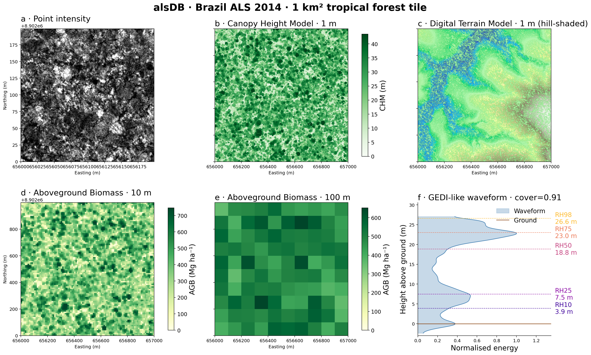

.. currentmodule:: alsdb

.. _whyalsdb:

Overview: Why alsDB?
====================

alsDB is a scalable Python package built to simplify working with **Airborne Laser Scanning (ALS)** point clouds from any national or global dataset. It reads LAZ/LAS files, stores them efficiently in a TileDB sparse array, and provides a complete pipeline for deriving forest structure products.

The motivation behind alsDB
---------------------------

Working with raw LAZ point clouds at scale presents several challenges:

- **Fragmented files**: National ALS campaigns deliver thousands of tiles that must be ingested, indexed, and queried as a unified dataset.
- **Multi-temporal surveys**: Many regions have been flown multiple times; storing and querying per-year data without file duplication requires a purpose-built schema.
- **Expensive HAG computation**: Height-above-ground requires a Delaunay TIN from ground points and is sensitive to tile-edge artefacts if tiles are processed in isolation.
- **Raster mosaic overhead**: Traditional pipelines produce per-tile GeoTIFFs that must be mosaiced into a final product: a slow, storage-intensive step that duplicates data.

alsDB was designed to address all of these by combining a **TileDB sparse array** for point storage with a **Zarr v3 store** for gridded outputs, connected by a tiled processing engine that handles buffering, parallelism, and idempotency automatically.

What alsDB enables
------------------

- **Unified multi-temporal point cloud**: All survey years in one TileDB array, queryable by bounding box and year.
- **Direct-to-Zarr processing**: CHM, DTM, DSM, gap fraction, LAI, structural metrics, and biomass are written tile-by-tile directly to the output store: no GeoTIFF intermediates, no mosaic step.
- **Dataset-agnostic ingestion**: CRS, bounding box, and acquisition year are read from the LAZ header automatically. Any national or global ALS dataset works without a custom parser.
- **Scalable tiling**: Large areas are split into sub-tiles with configurable size and buffer. Processing is parallel via a ``ThreadPoolExecutor`` with ``n_workers``.
- **Large-footprint waveform simulation**: Sensor-agnostic full-waveform simulation (GEDI, LVIS, GLAS) at configurable footprint scale for direct comparison with space-borne LiDAR.

Pipeline output: a 1 km² tropical forest tile
------------------------------------------------

The figure below shows the full alsDB pipeline applied to a Brazilian ALS
survey (2014).  From a single TileDB query the package derives a 1 m
Canopy Height Model, a hill-shaded DTM, aboveground biomass at two
resolutions, and a GEDI-like waveform with RH metrics.

   **alsDB output for a 1 km² tropical forest tile.**
   *(a)* Raw point cloud intensity (200 × 200 m sub-area).
   *(b)* Canopy Height Model at 1 m resolution.
   *(c)* Digital Terrain Model at 1 m with hill-shading.
   *(d)* Aboveground biomass at 10 m resolution.
   *(e)* Aboveground biomass at 100 m resolution.
   *(f)* Simulated GEDI-like waveform with RH10–RH98 annotations.

The two storage layers
-----------------------

alsDB uses two complementary storage backends:

**TileDB sparse array** (point clouds)
  Each LAZ tile is ingested into a 3-D sparse array with dimensions ``X`` (float64), ``Y`` (float64), ``Year`` (int16). Multiple survey years coexist in the same array. Spatial domain bounds are selected automatically per CRS. ByteShuffle + ZSTD compression is applied to float attributes; DoubleDelta + ZSTD to the Year dimension. Each ingested tile creates a new *fragment*; fragments are consolidated periodically to keep read performance healthy.

**Zarr v3 store** (gridded products)
  All processing outputs are written to an ``ALSZarrStore``: a Zarr v3 hierarchy organised by resolution (``1m/``, ``10m/``) with a time axis for multi-year products. Sub-tiles write directly to non-overlapping spatial slices in the shared arrays, so the product is complete as soon as the last tile finishes.

See :ref:`fundamentals` for a detailed explanation of both layers and how they interact.

Core components of alsDB
-------------------------

1. :py:class:`alsdb.ALSDatabase`: manages ingestion: LAZ → TileDB fragments, with a manifest for idempotency, parallel workers, and periodic consolidation.

2. :py:class:`alsdb.ALSProvider`: queries the TileDB array by bounding box and year, returning results as ``pandas.DataFrame`` or ``xarray.Dataset``.

3. ``ALSZarrStore``: the gridded output store. Accepts tile writes from all processing functions and exposes the result via ``to_dataset()`` as a CRS-aware ``xarray.Dataset``.

4. ``processing.*``: modular processing functions:

   - ``alsdb.processing.chm``: Canopy Height Model, DTM, DSM
   - ``alsdb.processing.gap``: gap fraction, effective LAI
   - ``alsdb.processing.biomass``: structural metrics, aboveground biomass
   - ``alsdb.processing.waveform``: large-footprint waveform simulation (GEDI by default)

Goals and aspirations
---------------------

alsDB's primary objective is to provide a reproducible, scalable platform for forest structure research from ALS data, including:

- **Forest structure monitoring**: Multi-temporal CHM, biomass, and LAI for tracking forest change.
- **GEDI validation**: Simulated waveforms at GEDI footprint scale for validating space-borne retrievals against airborne reference data.
- **Machine-learning pipelines**: Structural metric grids ready for training and predicting biomass or species composition models.

---

A project from GFZ Potsdam
===========================

alsDB was developed by Simon Besnard from the `Global Land Monitoring Group <https://www.gfz.de/en/section/remote-sensing-and-geoinformatics/topics/global-land-monitoring>`_ at the Helmholtz Centre Potsdam GFZ German Research Centre for Geosciences. It builds on design principles established in the GEDI-focused `gedidb <https://github.com/simonbesnard1/gedidb>`_ and ICESat-2-focused `icesat2db <https://github.com/simonbesnard1/icesat2db>`_ packages and adapts them to the challenges of national ALS campaigns. The project is open-source (EUPL-1.2) and welcomes contributions from the research community.

---
